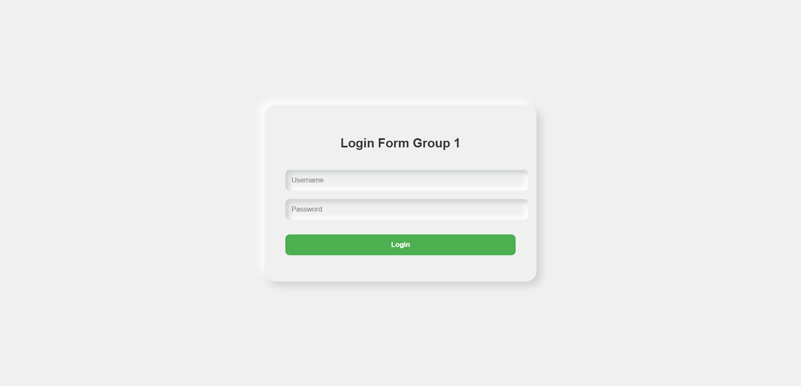

# Simple Login System

This is a simple login system implemented using HTML and CSS for the frontend and JavaScript for the backend validation. It allows users to input their username and password and verifies if they are valid credentials.
## Live Link
[Logiin](https://cletsymedia.github.io/group1_project/) 


## Features

- User-friendly login interface.
- Basic validation for username and password fields.
- Secure authentication using JavaScript.

## Usage

To use the login system, follow these steps:

1. Clone the repository to your local machine:

    ```bash
    git clone https://github.com/your-username/login-system.git
    ```

2. Navigate to the project directory:

    ```bash
    cd login-system
    ```

3. Open the `index.html` file in your web browser.

4. Enter your username and password in the respective fields.

5. Click the "Login" button to submit the form.

6. If the credentials are valid, you will be redirected to the dashboard page. Otherwise, an error message will be displayed.

## File Structure

- `index.html`: Contains the HTML structure of the login form.
- `style.css`: Stylesheet file for styling the login form.
- `script.js`: JavaScript file for validating user input and handling login logic.
- `README.md`: Documentation file providing information about the project.

## Contributing

Contributions are welcome! If you find any issues or have suggestions for improvement, please feel free to open an issue or submit a pull request.

## Authors

- CletsyMedia (cletussam12@yahoo.com)
- Faithyife (ifee.techglobal@gmail.com)
- NwoluDavid (Nwoludave@gmail.com)
- Fortune (Okolofortune4@gmail.com)

